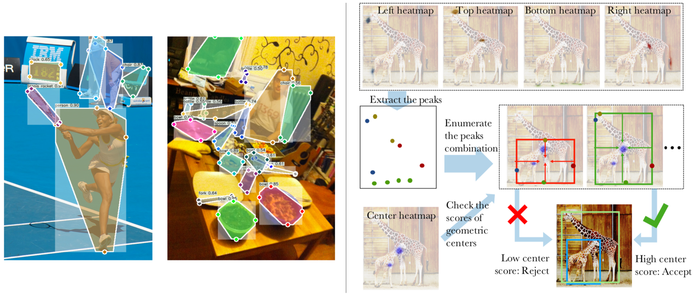

# ExtremeNet: Training and Evaluation Code
Code for **bottom-up** object detection by grouping extreme and center points:

> [**Bottom-up Object Detection by Grouping Extreme and Center Points**](https://arxiv.org/abs/xxxx.xxxxx),            
> Xingyi Zhou, Jiacheng Zhuo, Philipp Kr&auml;henb&uuml;hl,        
> *arXiv technical report*         

This project is developed upon the [CornerNet code](https://github.com/princeton-vl/CornerNet) and contains the code from [Deep Extreme Cut](https://github.com/scaelles/DEXTR-PyTorch). Thanks to the original authors!

Contact: [zhouxy2017@gmail.com](mailto:zhouxy2017@gmail.com). Any questions or discussions are welcomed! 

## Abstract 

With the advent of deep learning, object detection drifted from a bottom-up to a top-down recognition problem. State of the art algorithms enumerate a near-exhaustive list of object locations and classify each into: object or not. In this paper, we show that bottom-up approaches still perform competitively. We detect four extreme points (top-most, left-most, bottom-most, right-most) and one center point of objects using a standard keypoint estimation network. We group the five keypoints into a bounding box if they are geometrically aligned. Object detection is then a purely appearance-based keypoint estimation problem, without region classification or implicit feature learning. The proposed method performs on-par with the state-of-the-art region based detection methods, with a bounding box AP of 43.2% on COCO test-dev. In addition, our estimated extreme points directly span a coarse octagonal mask, with a COCO Mask AP of 18.9%, much better than the Mask AP of vanilla bounding boxes. Extreme point guided segmentation further improves this to 34.1% Mask AP.

## Installation
The code was tested with [Anaconda](https://www.anaconda.com/download) Python 3.6 and [PyTorch]((http://pytorch.org/)) v0.4.1. After install Anaconda:

1. Clone this repo:

    ~~~
    ExtremeNet_ROOT=/path/to/clone/ExtremeNet
    git clone --recursive https://github.com/xingyizhou/ExtremeNet ExtremeNet_ROOT
    ~~~

2. Create an Anaconda environment using the provided package list from [Cornernet](https://github.com/princeton-vl/CornerNet).

    ~~~
    conda create --name CornerNet --file conda_packagelist.txt
    source activate CornerNet
    ~~~

3. Compiling NMS (originally from [Faster R-CNN](https://github.com/rbgirshick/py-faster-rcnn/blob/master/lib/nms/cpu_nms.pyx) and [Soft-NMS](https://github.com/bharatsingh430/soft-nms/blob/master/lib/nms/cpu_nms.pyx)).

    ~~~
    cd ExtremeNet_ROOT/external
    make
    ~~~

## Demo

- Download our [pre-trained model](https://drive.google.com/file/d/1re-A74WRvuhE528X6sWsg1eEbMG8dmE4/view?usp=sharing) and put it in `cache/`.
- Optionally, if you want to test instance segmentation with [Deep Extreme Cut](https://github.com/scaelles/DEXTR-PyTorch), download their [PASCAL + SBD pertained model](https://data.vision.ee.ethz.ch/kmaninis/share/DEXTR/Downloads/models/dextr_pascal-sbd.pth) and put it in `cache/`. 
- Run the demo 

    ~~~
    Python demo.py ExtremeNet [--demo /path/to/image/or/folder] [--show_mask]
    ~~~

    Contents in `[]` are optional. By default, it runs the sample images provided in `ExtremeNet_ROOT/images/` (from [Detectron](https://github.com/facebookresearch/Detectron/tree/master/demo)). We show the predicted extreme point heatmaps (combined four heatmaps and overlaid on the input image), the predicted center point heatmap, and the detection and octagon mask results. If setup correctly, the output will look like:
    
     
    
    
 
        
    

    If `--show_mask` is turned on, it further pipelined with [Deep Extreme Cut](https://github.com/scaelles/DEXTR-PyTorch) for instance segmentation. The output will look like:
    
 
        
    

## Data preparation

If you want to reproduce the results in the paper for benchmark evaluation and training, you will need to setup dataset.

### Installing MS COCO APIs
~~~
cd ExtremeNet_ROOT/data
git clone https://github.com/cocodataset/cocoapi.git coco
cd ExtremeNet_ROOT/data/coco/PythonAPI
Make
python setup.up install --user
~~~

### Downloading MS COCO Data
- Download the images (2017 Train, 2017 Val, 2017 Test) from [coco website](http://cocodataset.org/#download).
- Download annotation files (2017 train/val and test image info) from [coco website](http://cocodataset.org/#download). 
- Place the data (or create symlinks) to make the data folder like:

  ~~~
  ${ExtremeNet_ROOT}
  |-- data
  `-- |-- coco
      `-- |-- annotations
          |   |-- instances_train2017.json
          |   |-- instances_val2017.json
          |   |-- image_info_test-dev2017.json
          `-- images
              |-- train2017
              |-- val2017
              |-- test2017
  ~~~
- Generate extreme point annotation from segmentation:
    
    ~~~
    cd ExtremeNet_ROOT/tools/
    python gen_coco_extreme_points.py
    ~~~
  It generates `instances_extreme_train2017.json` and `instances_extreme_val2017.json` in `data/coco/annotations/`. 

## Benchmark Evaluation

After downloading our pre-trained model and the dataset,

- Run the following command to evaluate object detection:

  ~~~
  python test.py ExtremeNet [--suffix multi_scale]
  ~~~
  The results on COCO validation set should be `40.3` box AP without `--suffix multi_scale` and `43.3` box AP with `--suffix multi_scale`. 

- After obtaining the detection results, run the following commands for instance segmentation:

  ~~~
  python eval_dextr_mask.py results/ExtremeNet/250000/validation/multi_scale/results.json
  ~~~
  The results on COCO validation set should be `34.6` mask AP (The evaluation will be slow).

- You can test with other hyper-parameters by creating a new config file (`ExtremeNet-<suffix>.json`) in `config/`. 

## Training 

You will need 5 12GB GPUs to reproduce our training. Our model is fine-tuned on the 10-GPU pre-trained [CornerNet model](https://drive.google.com/file/d/1UHjVzSG27Ms0VfSFeGYJ2h2AYZ6d4Le_/view?usp=sharing) (training from scratch may result in 2 AP lower based on our preliminary experiments). After downloading the CornerNet model and put it in `cache/`, run

~~~
python train.py ExtremeNet
~~~

You can resume a half-trained model by 

~~~
python train.py ExtremeNet --iter xxxx
~~~

## Citation
If you find this model useful for your resesarch, please use the following BibTeX entry.

    @inproceedings{zhou2019bottomup,
      title={Bottom-up Object Detection by Grouping Extreme and Center Points},
      author={Zhou, Xingyi and Zhuo, Jiacheng and Kr{\"a}henb{\"u}hl, Philipp},
      booktitle={arXiv preprint arXiv:xxxx.xxxxx},
      year={2019}
    }
    
Please also considering citing the CornerNet paper (where this code is heavily borrowed from) and Deep Extreme Cut paper (if you use the instance segmentation part).

    @inproceedings{law2018cornernet,
      title={CornerNet: Detecting Objects as Paired Keypoints},
      author={Law, Hei and Deng, Jia},
      booktitle={Proceedings of the European Conference on Computer Vision (ECCV)},
      pages={734--750},
      year={2018}
    }

    @Inproceedings{Man+18,
      Title          = {Deep Extreme Cut: From Extreme Points to Object Segmentation},
      Author         = {K.K. Maninis and S. Caelles and J. Pont-Tuset and L. {Van Gool}},
      Booktitle      = {Computer Vision and Pattern Recognition (CVPR)},
      Year           = {2018}
    }